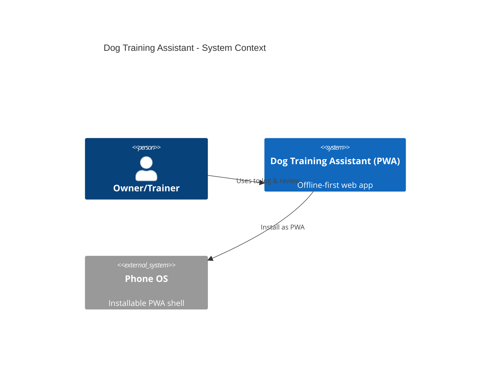
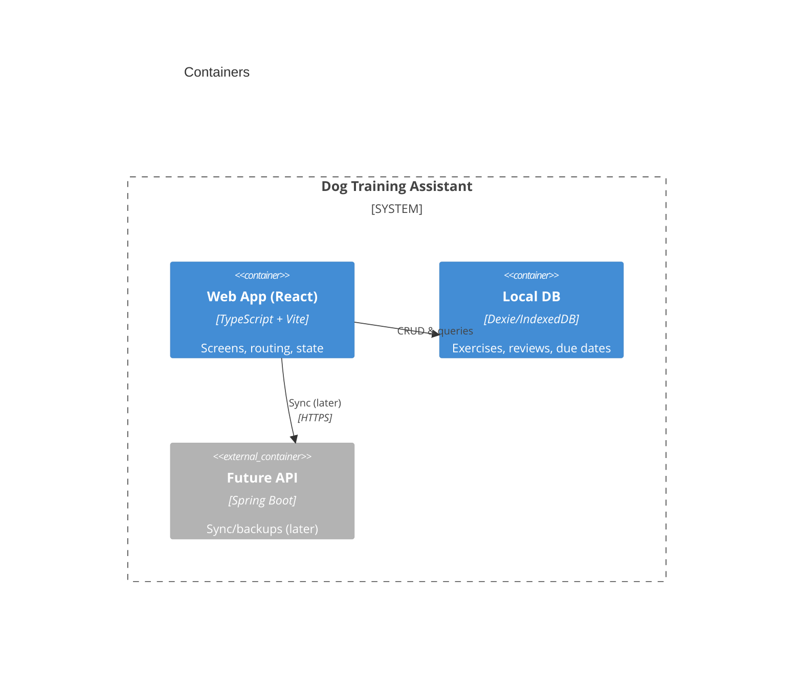
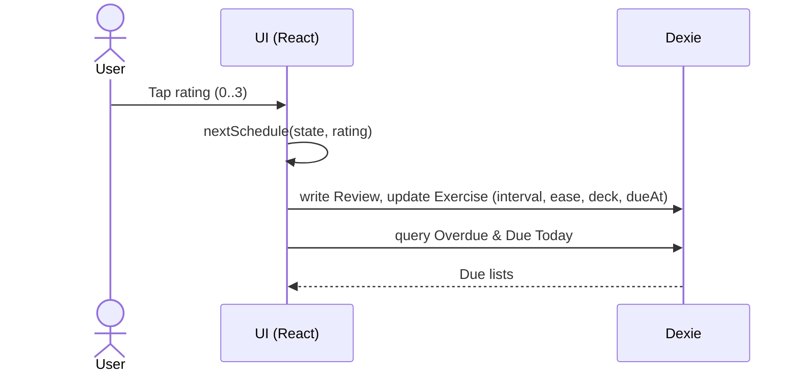

# Dog Training Assistant — Project Context

> Local-first PWA to create, review, and resurface dog-training exercises with spaced repetition. Runs offline at dog school and installs to your phone.

## 1) Goals & Non-Goals
**Goals**
- Capture custom exercises (“tricks”), log quick results, and automatically schedule reviews.
- Gently resurface **neglected basics**; keep **solid skills** on a longer cadence.
- Phone-friendly, offline-first, installable (PWA).

**Non-Goals (for MVP)**
- No accounts/sync/back-end (can add later).
- No push notifications (badge + “Due Today” screen is enough at first).

---

## 2) MVP Scope (v0.1)
**User stories**
- As a user, I can add/edit exercises with notes/tags.
- I can log today’s practice with one tap (❌ forgot / 😣 hard / 🙂 ok / 😎 easy).
- I see **Overdue**, **Due Today**, and **All** lists.
- The app schedules the **next due date** automatically.

**Screens**
- **Home**: count + list for “Due Today” and “Overdue”.
- **Exercises**: searchable list; add/edit form.
- **Exercise Detail**: big 4-button logger; shows brief history.
- **(Optional)** History: last N sessions.

---

## 3) Scheduling algorithm (Leitner / SM-2-lite hybrid)
**Rating scale:** `0=forgot`, `1=hard`, `2=ok`, `3=easy`  
**State per exercise:** `intervalDays`, `ease`, `deck` (1..5)

**Update rules after each review**
- **3 (easy):** `interval = ceil(interval * 2.0)`; `ease = min(ease+0.05, 3.0)`; `deck = min(deck+1, 5)`
- **2 (ok):**   `interval = ceil(interval * 1.4)`; ease unchanged; deck unchanged
- **1 (hard):** `interval = 2`; `ease = max(ease-0.15, 1.8)`; `deck = max(deck-1, 1)`
- **0 (forgot):** `interval = 1`; `ease = max(ease-0.30, 1.8)`; `deck = 1`

**Optional deck clamps (minimum intervals per deck)**
```
deck 1 ≥ 1d   deck 2 ≥ 3d   deck 3 ≥ 7d   deck 4 ≥ 14d   deck 5 ≥ 30d
interval = max(interval, deckMin[deck])
```

**Next due:** `dueAt = today + interval`.

**Neglect bucketing**
- **Overdue**: `dueAt < today`
- **Due Today**: `dueAt === today`
- **Upcoming**: `dueAt > today`  
Sort: oldest overdue first → due today → nearest upcoming.

---

## 4) Data model (TypeScript)
```ts
// /src/db/client.ts
export type Rating = 0 | 1 | 2 | 3;

export interface Exercise {
  id: string;
  name: string;
  description?: string;
  tags: string[];
  createdAt: string;
  lastReviewedAt?: string;
  intervalDays?: number; // default 1
  dueAt?: string;        // ISO date
  ease?: number;         // default 2.5 (1.8..3.0)
  deck?: number;         // 1..5 (default 1)
}

export interface Review {
  id: string;
  exerciseId: string;
  ratedAt: string; // ISO
  rating: Rating;
  notes?: string;
}
```

---

## 5) Tech stack & tools
- **App**: React + TypeScript + Vite (**PWA** via `vite-plugin-pwa`)
- **Storage**: Dexie (IndexedDB) — offline, durable
- **Routing/Data**: React Router, TanStack Query
- **Tests**: Vitest + React Testing Library (unit/component), Playwright (E2E)
- **CI**: GitHub Actions (later)
- **Design/flow**: tldraw for wireframes; Mermaid in Markdown for C4 + sequences
- **Device preview**: Responsively App
- **Share to phone**: Pinggy tunnel (`ssh -p 443 -R0:localhost:5173 a.pinggy.io`)
- **Dev utilities**: DevToys (JSON, UUIDs, enc/dec, diff)
- **OS**: Windows 10

---

## 6) Repo structure (target)
```
dog-training-assistant/
  app/
    src/
      components/
      pages/
      services/
      db/
      main.tsx
    e2e/                 # Playwright tests
    tests/               # Vitest unit/component tests
    vite.config.ts
    vitest.setup.ts
    playwright.config.ts
    package.json
  docs/
    project-context.md   # (this file)
    architecture.md      # Mermaid diagrams
    ui-mockups/          # exports from tldraw
```

---

## 7) Setup notes (Windows 10)

### One-time installs (winget)
```powershell
winget install -e --id Git.Git
winget install -e --id GitHub.cli
winget install -e --id OpenJS.NodeJS.LTS
winget install -e --id DevToys-app.DevToys
# Responsively: search first, then install the exact ID
winget search responsively
winget install -e --id ResponsivelyApp.ResponsivelyApp
# Optional for Pinggy over SSH:
Add-WindowsCapability -Online -Name OpenSSH.Client~~~~0.0.1.0
```

### PowerShell execution policy (permanent fix)
```powershell
Set-ExecutionPolicy -Scope CurrentUser -ExecutionPolicy RemoteSigned -Force
# (If you also use PowerShell 7 / pwsh, run the same there once.)
```

### Clone & scaffold (summary)
```powershell
# After gh auth login (HTTPS or working SSH)
gh repo clone BelaGereon/dog-training-assistant
cd .\dog-training-assistant\
npm create vite@latest app -- --template react-ts
cd .\app\
npm i

# Deps
npm i dexie react-router-dom @tanstack/react-query
npm i -D vite-plugin-pwa vitest @testing-library/react @testing-library/dom jsdom @playwright/test
npx playwright install
```

---

## 8) Testing strategy (TDD)

### Seed tests (write first)
1. `scheduling.test.ts`
   - Easy doubles interval, Ok ~×1.4, Hard→2 days, Forgot→1 day
   - Ease increases/decreases/clamped; deck moves; `dueAt` math
2. `planner.test.ts`
   - Correct bucketing (Overdue/Today/Upcoming) and sort order
3. `repo.test.ts` (integration-ish with Dexie)
   - Insert exercise + reviews, query due items for today

**Implementation slice**:  
- Pure function `nextSchedule(state, rating, today)` → red → green → refactor  
- Planner service for bucketing → tests first  
- Minimal UI component that renders a provided list prop (test with RTL)

### Playwright (E2E) — keep separate from Vitest
- Tests live in `/app/e2e/`
- `playwright.config.ts`:
  ```ts
  import { defineConfig } from '@playwright/test';
  export default defineConfig({
    testDir: './e2e',
    use: { baseURL: 'http://localhost:5173', headless: true },
    webServer: { command: 'npm run dev', url: 'http://localhost:5173', reuseExistingServer: true, timeout: 120000 }
  });
  ```
- **No** `@testing-library/jest-dom` in E2E.  
- Vitest setup file only for unit tests: `/app/vitest.setup.ts`
  ```ts
  import '@testing-library/jest-dom';
  ```
- In `vite.config.ts`:
  ```ts
  test: { environment: 'jsdom', setupFiles: './vitest.setup.ts' }
  ```

---

## 9) PWA wiring (minimum)
`vite.config.ts`
```ts
import { defineConfig } from 'vite'
import react from '@vitejs/plugin-react'
import { VitePWA } from 'vite-plugin-pwa'

export default defineConfig({
  plugins: [
    react(),
    VitePWA({
      registerType: 'autoUpdate',
      manifest: {
        name: 'Dog Training Assistant',
        short_name: 'DogTrainer',
        start_url: '/',
        display: 'standalone',
        background_color: '#ffffff',
        theme_color: '#111827',
        icons: [] // TODO: add real icons
      }
    })
  ],
  test: { environment: 'jsdom', setupFiles: './vitest.setup.ts' }
})
```

---

## 10) Architecture (Mermaid snippets)

**System Context**


**Container View**


**Sequence (log review)**


---

## 11) VS Code + Codex usage
- Keep this file as the **source of truth** for the agent.  
- In Codex prompts, reference it and relevant files with `@`:
  > “Using **@docs/project-context.md** and **@src/services/scheduling.ts**, implement the rating rules and add tests.”

- Browser chat ≠ IDE chat; use **Projects** on web for organization, but rely on this repo doc for IDE context.

---

## 12) Roadmap
- **v0.1** (MVP): add/edit exercises, 4-button logger, due/overdue lists, offline PWA, basic tests, E2E smoke.
- **v0.2**: tags/filters, history view, CSV/JSON export (backup), simple progress stats.
- **v0.3**: home badges, install banners, icon set, theming/dark mode.
- **v0.4**: optional sync (Spring Boot + Postgres), account export/import.
- **Later**: “general exercises” library; reminders; richer analytics; sharing presets.

---

## 13) Definition of Done (per slice)
- Unit tests (Vitest) **green** and meaningful.
- E2E happy path (Playwright) **green**.
- Works offline (devtools Application → Service Workers registered; reload offline).
- Mobile layout verified in Responsively.
- Minimal docs updated (`project-context.md`, code comments if needed).

---

## 14) Decision log
- **Local-first PWA** with Dexie (IndexedDB).
- **Leitner/SM-2-lite** hybrid for scheduling (0..3 ratings).
- **Separate** Vitest vs Playwright environments to avoid matcher conflicts.
- Skip **rolldown-vite** for now (use standard Vite; revisit later).

---

_Keep this document short but living: update as decisions change. It’s your shared brain between browser and IDE._
